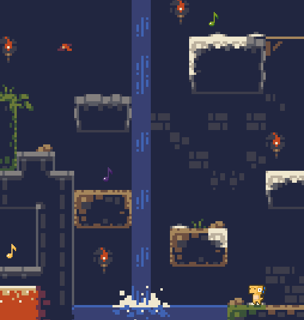

# Dyno-mic Music

` `

This is a prototype of a game in-the-works. It features a Dino that that collects music notes; each time a note is collected, a new instrument of the music arrangement is added to the "ensemble".

It is still very much in the early stages of development, but I wanted to get a working prototype out as fast as possible.

I created this project out of a desire to learn the Godot gaming engine.

---

If you would like to learn more about my journey so far, please check out [my devlogs](./devlogs/README.md)

I you would like to play the prototype, it can be found on [itch.io](https://some-antics.itch.io/)

