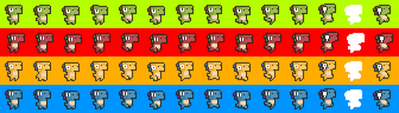
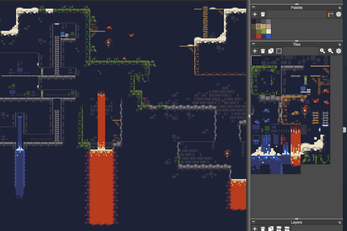
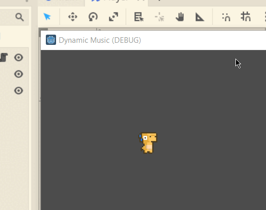
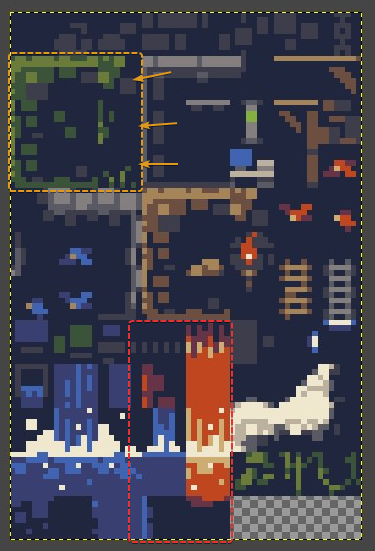
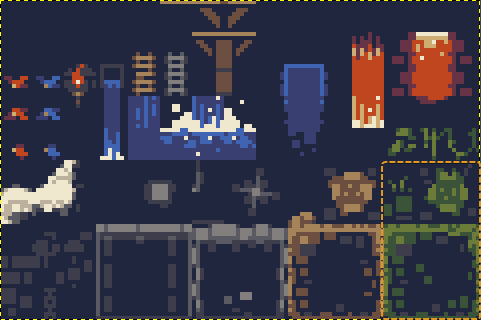
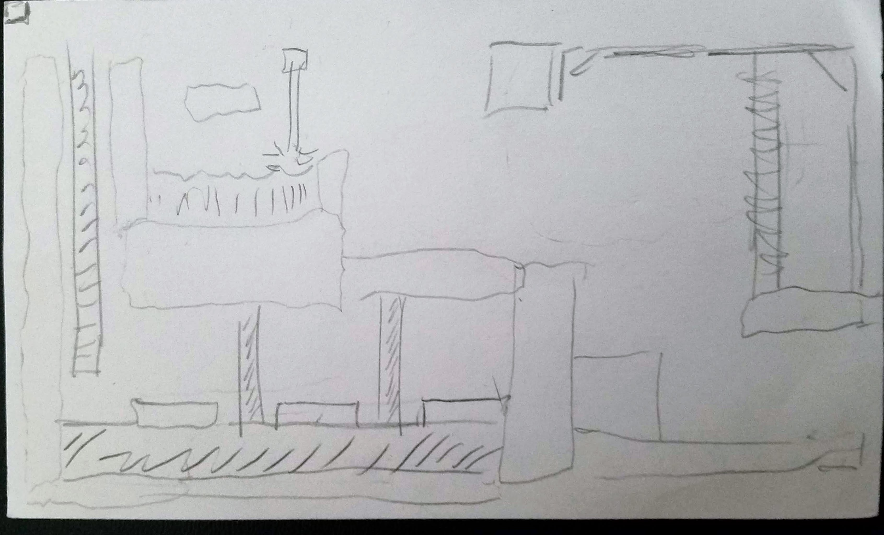
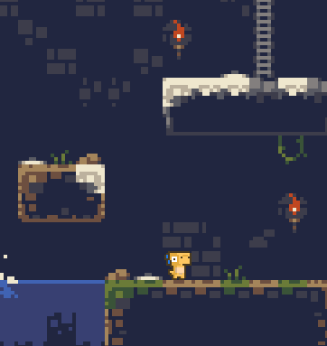
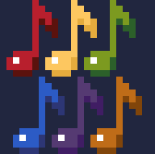
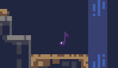

# Devlog - 10 May 2022 <!-- omit in toc -->

- [Basic Idea (10 May 2022)](#basic-idea-10-may-2022)
- [Pre-work](#pre-work)
- [Player Scene](#player-scene)
- [The Tilemap](#the-tilemap)
- [Back to the Player (11 May 2022)](#back-to-the-player-11-may-2022)
- [Music Notes Sprites](#music-notes-sprites)
- [Dynamic Music](#dynamic-music)
- [What's Next?](#whats-next)
  - [Todo](#todo)

---

## Basic Idea (10 May 2022)

I know (somewhat) how to use the Unity game engine; I've done a game jam using it and a separate project as well. But I've been seeing a lot about Godot and wanted to come up with a project that would be a simple way for me to learn it, and yet something that *could* scale up if I decided that I liked the engine and project enough to keep going. That's where this idea comes from.

The basic idea is that there would be character jumping around, collecting music notes; each note collected would add a new element to the music track. So at the start, just a simple beat is playing, but by the end of the level, the player (hopefully) is jamming out to the music.

---

## Pre-work

I started by creating a design document via google docs; I dumped all my ideas, and then organized them into "*prototype*", "*MVP*" (ready for itch.io), and "*Post-MVP*".

Then I gathered assets. I found a really cute set of dino sprites created by [@ScissorMarks (twitter)](https://twitter.com/ScissorMarks) on itch.io [here](https://arks.itch.io/dino-characters)

` `

And I found [this tilemap](https://adamatomic.itch.io/cavernas) named "The Caves of Gallet", created by [Adam Saltsman](https://adamatomic.itch.io/)

` `

After that, I learned the basics of the Godot engine using this [youtube tutorial](https://www.youtube.com/watch?v=WEt2JHEe-do&t=1862s) by [GDQuest](https://www.youtube.com/channel/UCxboW7x0jZqFdvMdCFKTMsQ). I was finally ready to start my project!

---

## Player Scene
I started by creating the player scene with a yellow dino. It took me a while to figure out that I should be using a "`KinematicBody`" node, but after I figured that out, I added a 2d collision shape, and a sprite animator.

Animations and movement was next. I created a script, listened for inputs, and animated accordingly. Movement was pretty straight forward as well.

After that, I made the poor decision of renaming and organizing some of my files. I ended up screwing up some dependencies on the player scene root node. So I ended up having to redo all the steps I just mentioned. Nothing like doing it twice to really solidify it.

---

## The Tilemap
Creating the tileset for the tilemap took longer than expected. Too long.

In the Godot tileset editor, each auto-tile and tile-atlas can only be selected from the source image using a single rectangle, meaning you can't add select areas by holding `[Ctrl]` or `[Shift]`. So I would select an area for an atlas and end up with more tiles than I wanted grouped in with the ones I *did* want. (seen by the red dashed square)

The other issue was that I was actually missing a whole side (or more) from some 3x3 blocks (the orange square & arrows). So auto tiles weren't really an option with this setup, and I would need to place everything pretty much manually, by rotating and flipping the tiles. No thank you.

So.

I created my *own* tilemap from the downloaded one with better positioning, and a few more tiles added to complete the 3x3 squares. Yay! All better.

After all those shenanigans, I mocked up a rough level on a note card, and then built it using the tilemap.

Some "bugs" still exist with the auto-tiles (meaning I didn't really set them up right), but the most part, this step was pretty easy.

` `

Something that I will definitely take away from this project is the importance of prototyping. If I could go back, I would just have started with plain 'ol squares, and worried about animation and tilemaps later. They ended up being more trouble that they were worth (at the start at least).
Which is hilarious, because in my design document, *that **I** wrote* it says that for the prototype, everything should just be a square, but I failed to follow my own advice.

At any rate, now that the tilemap is done, I'm ready to go back to finishing the player, implementing gravity and collision with the stage.

---

## Back to the Player (11 May 2022)
I implemented gravity and collision with the stage. I thought it would be harder, but godot makes it really easy. All I ended up doing was changing the movement logic to account for x and y (using Vector2 instead of a single float). In addition to that, I used the built-in `move_and_slide()` function, and bada-bing bada-boom, collision works!

Making the player jump was pretty simple as well; just add a set amount of negative velocity to the player when "jump" is detected and if the player `is_on_floor()` returns true. Man, godot implements some of its concepts elegantly.

---

## Music Notes Sprites
Next were the music notes. I google image-ed...? "pixel art notes" and pretty much straight up copied a design I liked. I used Gimp to create the sprites, and it took me a while to figure out how to set the software up for pixel art.

So after making a note that I liked using a 2-tone gray palette, I colored them. And here's the result. Exporting them one a time, they were now ready to be added to the game.

---

## Dynamic Music

At this point, I wasn't really sure where to start. I had watched a couple Youtube tutorials that talked about horizontally mixing music, but they all talked about the theory, and I couldn't find a detailed implementation in Godot that I could follow along with. What I *did* find was mention of a Godot addon/library called [Mixing Desk for Godot](https://github.com/kyzfrintin/Godot-Mixing-Desk) that supposedly made it easier to mix music dynamically. So I bookmarked the github page and moved on.

I was going to compose **new** music for this game, but partway through trying to come up with a few instruments in Bosca Ceoil, I decided to dodge my *previous* pitfall, and just focus on creating a working prototype as fast as possible. So I found a track I had made but never used, broke it up into its three instruments, and imported them into the project separately.

*
"Dino Synth" in Bosca Ceoil
*

Time to learn about Mixing Desk!

This took me several hours. Reading documentation, setting up a song with its three tracks. Running into `"reference node not found"` errors when trying to use auto-play.

Eventually I set everything up. Here's how it works:

The `MixingDesk` is in its own scene, and when the `Main` scene loads, it tells the desk to play the song, but to mute all the tracks. Then each note has a signal that it emits when the player collects it, which the main scene receives, and tells the desk to un-mute the track associated with that note. (When placing a note, you can tell it a color and a track name)

The note also has a fade-out animation, and once that is finished, it queues itself for deletion. Essentially, just a bunch of little pieces working together. Pretty cool.

---

## What's Next?

So now I have a basic 2d platformer in which the player can collect notes that unlock different parts of the score. A decent prototype, if I do say so myself. And I've got the basic building-blocks all setup to start creating actual themed levels, music, etc.

However, there's quite a lot of things to do. In no particular order, here's a list of (some of) them.
### Todo
- the level looks dead, like it's frozen in time; the bird, torches, water, mist from the waterfall, should *all* be animated
- interaction/collision with the water and lava
- more songs broken down into more tracks
- add sound effects for the player
- obstacles for the player
- level ends properly
- menu screen
  - level select
  - settings?

