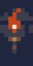
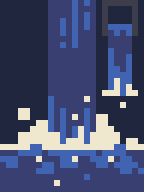

# Devlog 1.1 - MVP pt 1 <!-- omit in toc -->

- [Posting the project to itch.io](#posting-the-project-to-itchio)
- [Uploading to Github and creating a Github project](#uploading-to-github-and-creating-a-github-project)
- ["Breathing life" into the game](#breathing-life-into-the-game)
- [Updating Character Behavior](#updating-character-behavior)

## Posting the project to itch.io
`(24 May 2022)`

I knew that I wanted to try to get an early build of the game onto itch, even if it was a prototype; I wanted the experience of exporting from Godot early on, so that if I ran into trouble, I could fix it when the code base wasn't ginormous.

I didn't run into many issues though, surprisingly enough. There was a little trick with the html5 export that I didn't quite get, and it wasn't explicit in the youtube tutorial I was watching, but I figured it out after reading the docs. (Really, I should have just gone there first)

The real challenge of uploading the game was the post itself. I'd been writing a paragraph or two into the devlog every time I completed a chunk of work, so I had all the text I needed for that. However, copy pasting that into the itch.io text editor, and tweaking it to have the correct formatting was... unenjoyable. Getting all the gifs and screenshots I needed was also pretty tedious.

It really wasn't all that bad, just way more involved than I was expecting. And now that I've done it once, it'll get easier every time after that. The way that people will perceive this game on a first-impression basis is really important if I want play-testers & feedback. It's something that I also don't feel too confident about my skill in it. Another reason that I started doing it right away.

## Uploading to Github and creating a Github project
`(24 May 2022)`

Before posting the game, I failed to mention, I made a repository with all my code, along with all the markdown documents and assets for these devlogs. After posting the game, I went back to the google doc design document, and tried to start figuring out what I should do next. It got confusing quickly, and so I started searching for a tool to use to better manage the project.

Enter "Github Projects (Beta)". I've used a Github projects in the past, for a discord bot, and it worked pretty well, but Github has a new version called *the same exact thing*, except with "(beta)" attached to the end. I won't bore you with the minutia, but they both essentially do the same thing: help you break down big problems (creating a game) into smaller, more manageable, tasks. It helps you keep track of what's planned **next**, what's being done, and what is finished. It's a great tool, especially if you've got a team of more than one.

## "Breathing life" into the game
`(24 May 2022)`

Alrighty, onto the actual game-making. Something I noticed when getting ready to post to itch.io was that the game seemed almost frozen in time and frankly kind of dead. So I decided to "breath life" into the game with animated tiles. Specifically the torches, birds, water, and some greenery.

There is a bigger list than that, but in the spirit of not scoping myself out of a realistic release schedule, I decided to go with those first. I can always go back and finish if I find I have more time.

*Here are the results, in attempted order*

I think I got better as I went along

However, if you think that they look a little weird anyway, you'd be correct. Pixel art (art in general) is not my strong suit. And certainly animation is not either.

I started with the torch, but I just couldn't *quite* get it to look the way I wanted it to. So I just kind of said, "god enough" and imported it into the game as an animated texture.
When I was messing around with frame rates, I found that when I used just the right one, it looked like the flame was dancing along to the beat. So I leaned into it, and each animation forward I made sure they were all 4, 8, or 16 frames, with emphasis on the frames on the beats so they would emphasize the sync.

**Math tangent:** I did some math to figure out the *exact* right fps for the `8-frame` torch animation to sync up with the `100 bpm` song. It turned out to be `6.666...` which isn't ideal. Godot ended up rounding it up to 6.7, and the animation- after a long while- becomes decoupled from the music. The music creation tool that I use is [Bosca Ceoil](https://terrycavanagh.itch.io/bosca-ceoil), and it allows for increments of 5 when speeding up the tempo of a song. Which is actually perfect, because when I calculate the fps for a song at 105 bpm, I get 5! So, I think I'll be making the music just a little faster so that my animations all line up a little better to the music.

But, for now I'll leave that up to *future* me (sucker), and I'll tick the

- [x] "breath life into the game"

box

---

## Updating Character Behavior
Woohoo!
